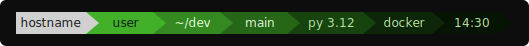
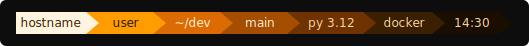

# starship_theme

My personal-flavored [Starship](https://starship.rs) prompt
configuration. It is a powerline-style layout shaped around my own
daily workflow, with multiple built-in palettes and role-based color
naming for easy per-host customization.

This is not a general-purpose theme. The segment order, the glyphs,
the palette choices, and the accent colors all reflect personal taste
more than any universal design principle. Use it as-is if it happens
to fit your setup, or treat it as a starting point and bend it to
your own preferences.

## Preview

The prompt renders as a chain of colored segments joined by powerline
triangle separators:

```
[OS][hostname][user][directory][git][language][env][time]
```

Each segment has its own background color, and separators bridge
adjacent segments so the color transitions are seamless.

## Palettes

Eight palettes are included. Switch between them by editing the
`palette` line at the very top of `starship.toml`:

```toml
palette = 'mac'
```

### mac

Apple aluminum and space gray tones (default).


### windows

Windows 11 Fluent design with signature blue.


### nvidia

NVIDIA green gradient.


### amd

AMD red gradient.


### intel

Intel blue gradient with cyan accent.


### lablup

Lablup green gradient.



### backend_ai

Backend.AI orange based on official brand colors.



### aigo

Backend.AI Go header gradient from blue to peach.


## Installation

1. Install [Starship](https://starship.rs/guide/#step-1-install-starship).
2. Copy `starship.toml` to your Starship config location:
   - Linux and macOS: `~/.config/starship.toml`
   - Windows: `~/.config/starship.toml` or
     `%USERPROFILE%\.config\starship.toml`
3. Make sure your terminal uses a [Nerd Font](https://www.nerdfonts.com)
   so the OS icons, language glyphs, and powerline separators render
   correctly.
4. Open a new shell. The prompt should appear on first use.

## Customization

### Switching palettes

Change the `palette` key in `starship.toml`:

```toml
palette = 'nvidia'
```

### Per-host palettes

Color keys use role-based names of the form `color_bg_<role>` and
`color_fg_<role>`, not raw color names. This makes it easy to define a
new palette for a specific host without touching any segment or
separator definitions.

To add a palette for a specific machine, append a new
`[palettes.<name>]` block with the same key set used by the existing
palettes, then set `palette = '<name>'` in that host's copy of the
config.

The full key set is:

```
color_bg_hostname, color_fg_hostname
color_bg_user, color_fg_user
color_bg_directory, color_fg_directory
color_bg_git, color_fg_git
color_bg_language, color_fg_language
color_bg_environment, color_fg_environment, color_fg_environment_accent
color_bg_time, color_fg_time
color_fg_success, color_fg_error
color_fg_vim_normal, color_fg_vim_replace, color_fg_vim_visual
```

Every palette must define all of these keys. A missing key causes
Starship to fall back to defaults, which breaks the color chain between
segments.

### Adjusting layout

The segment order is defined by the `format` string at the top of the
file. If you reorder, insert, or remove segments, remember to update
each adjacent separator so its `fg` and `bg` match the neighboring
segment backgrounds. See `AGENTS.md` for the full color-chaining rule.

## Editing notes

`starship.toml` contains Nerd Font glyphs in the Unicode Private Use
Area. Some editors and terminal environments may not render these
glyphs, which can make them look like empty strings even though the
bytes are present.

When editing, prefer tools and workflows that preserve bytes exactly
rather than retyping entire lines. See `AGENTS.md` for detailed
guidelines.

## License

See `LICENSE`.
